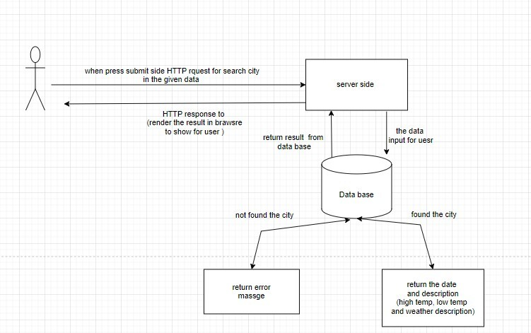

# Project Name

city explorer api

**Author**: Zaid Alshibi
**Version**: 1.0.0

## Overview

An API that used to

## Getting Started

- initialize the server with express, dotenv and cors

- initialize with npm init

- add the .gitignore and .eslintrc.json

- add the required data to weather.json file

- add the port to .env file and make sure that it is included in the .gitignore file

## Architecture

- express

- dotenv

- CORS

## Change Log

01-08-2022 08:00 pm - Application now has a fully-functional express server, with a GET route for the location resource

## Credit and Collaborations

### in collaborate with Qais Al-Sgher [GitHub project repo](https://github.com/qais-alsgher/city-explorer)

Name of feature: Server

Estimate of time needed to complete: 12 hours

Start time: 2:00 pm

Finish time:

Actual time needed to complete: _____
